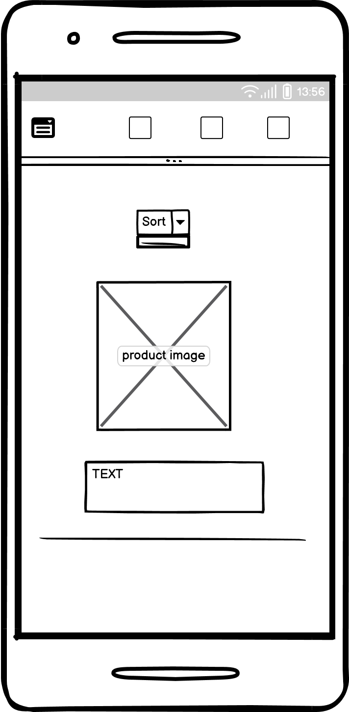

# Hearten Horticulture Webshop

##### **[Click here for the deployed site](https://hhwebshop-a59157177b87.herokuapp.com/)**
-----------------------
The Hearten Horticulture Webshop is an e-commerce store for garden related products. It offers a wide range of tools, seeds and clothing to get started with horticulture. 
The site is easy to use and offers full functionality to purchase goods with a credit or debit card payment. It is a great starting point for any gardener, offering all products for horticulture and garden space DIY tasks.
<br><br>


## UX

Using Code Institute's Boutique ado project module as a base, I was able to modify parts of the code to suit the requirements of the site.
The site's aim is simplicity for the user to find and purchase a product they require. There is a minimalist layout specifically as gardeners tend to occupy the demographic of an older generation, who are often unfamiliar with the internet and e-commerce in general. They would have no issue in finding a product for their needs based on the navbar's clear layout, or by using the centrally located search bar.

### Colour Scheme

The colours used in the scheme are primarily based on green for plants, blue for water, brown for soil/ground and yellow for sun.
The shades have been lightened or darkened accordingly for their primary usage

- `#628321` : used for primary text.
- `#fffacd` : used for background colour 
- `#6c9dc6` used for secondary text.
- `#4643d` used for secondary highlights.

I used [coolors.co](https://coolors.co/628321-fffacd-6c9dc6-a4643d) to generate my colour palette.


I've used CSS `:root` variables to easily update the global colour scheme by changing only one value, instead of everywhere in the CSS file.

```css
:root {
    /* P = Primary | S = Secondary */
    --p-text: #628321;
    --p-highlight: #fffacd;
    --s-text: #6c9dc6;
    --s-highlight: #4643d;
    --white: #FFFFFF;
    --black: #000000;
}
```

### Typography

As the main logo for Hearten Horticulture is written in Barlow Condensed, this will be the main font, with sans serif as a backup.
Lato will be primarily used for sub-headings. Font awesome has been used for some special characters and icons.

- [Barlow Condensed](https://fonts.google.com/specimen/Barlow+Condensed) was used for the primary headers and titles.

- [Lato](https://fonts.google.com/specimen/Lato) was used for all other secondary text.

- [Font Awesome](https://fontawesome.com) icons were used throughout the site, such as the social media icons in the footer.

## User Stories

- As a user, I want to create an account easily so that I can save my preferences, view my order history, and manage my shipping information.
- As a user, I want to search for plants or tools by their names or categories to explore available options.
- As a user, I want to add items to my shopping cart and proceed to checkout to purchase the selected products.
- As a user, I want to access my order history to review past purchases
- As a user, I want to receive a confirmation email after placing my order for reference and tracking purposes.

### New Site Users

- As a new site user, I would like to create an account, so that I can save my preferences, track my orders, and easily manage my information.
- As a new site user, I would like to explore a variety of plants and gardening tools, so that I can make informed decisions about what suits my gardening needs.
- As a new site user, I would like to have a simple and intuitive navigation system, so that I can easily find what I'm looking for without feeling overwhelmed.
- As a new site user, I would like to access customer support easily, so that I can get assistance whenever I have questions or encounter issues while using the site.
- As a new site user, I would like to read reviews and ratings from other customers, so that I can make more informed decisions about the quality and suitability of plants and gardening products before making a purchase.

### Returning Site Users

- As a returning site user, I would like to access my previous order history, so that I can track my past purchases and easily reorder items.
- As a returning site user, I would like to update my saved shipping addresses, so that I can efficiently send gifts or order items for different locations.
- As a returning site user, I would like to easily connect with customer support, so that I can receive assistance or address any issues promptly.

### Site Admin

- As a site administrator, I should be able to manage user accounts and permissions, so that I can control access levels and ensure site security.
- As a site administrator, I should be able to update and add new product listings, so that I can keep the site content current and attractive to customers.
- As a site administrator, I should be able to monitor and respond to customer feedback or reviews, so that I can maintain a positive user experience and address any issues promptly.
- As a site administrator, I should be able to configure and maintain the site's backend infrastructure, so that I can ensure smooth site functionality and address any technical issues that arise.

## Wireframes

To follow best practice, the wireframes for the site were developed for mobile, tablet, and desktop sizes.
I've used [Balsamiq](https://balsamiq.com/wireframes) to design my site wireframes.

### Mobile Wireframes

<details>
<summary> Click here to see the Mobile Wireframes </summary>

Home
  - 

Products
  - 

Product details
  - 

Registration
  - 

My Profile
  - 

Sign in 
  - 

Sign out
  - 

Bag 
  - 

Checkout Success
  - 

Add a product
  - 

Edit a product
  - 

</details>

### Tablet Wireframes

<details>
<summary> Click here to see the Tablet Wireframes </summary>
Home
  - 

Products
  - 

Product details
  - 

Registration
  - 

My Profile
  - 

Sign in 
  - 

Sign out
  - 

Bag 
  - 

Checkout Success
  - 

Add a product
  - 

Edit a product
  - 

</details>

### Desktop Wireframes

<details>
<summary> Click here to see the Desktop Wireframes </summary>

Home
  - 

Products
  - 

Product details
  - 

Registration
  - 

My Profile
  - 

Sign in 
  - 

Sign out
  - 

Bag 
  - 

Checkout Success
  - 

Add a product
  - 

Edit a product
  - 


</details>

## Features

### Multi-Page Features: 
### Navigation

#### Top Navigation:
The top navigation serves as a hub for essential site functions. Here's what it offers:

#### Logo & Search Bar: 
Easily spot the site's logo for brand recognition and use the search bar to explore products.

#### Login/Register: 
Access the "My Account" icon for a seamless login or registration experience.

#### Shopping Bag: 
Monitor the shopping bag's contents conveniently.

#### User-Specific Dropdown: 
Once logged in, the dropdown menu within "My Account" dynamically adjusts based on the user's role—Shop Owners/Administrators access "Product Management" while shoppers navigate to "My Profile". The "Log Out" option ensures smooth user management.

#### Main Navigation:
Accessible via the hamburger icon on mobile devices, the main navigation focuses on:

Product Categories: Delve into diverse product categories for a comprehensive exploration.
Responsive Design:
The website prioritizes responsiveness across devices. Check out these screenshots showcasing the design's adaptability:

Navbar - Desktop
Navbar - Mobile
My Account - Logged out
My Account - Shopper
My Account - Shop Owner/Administrator
This deliberate design strategy aims for intuitive interactions and responsiveness, ensuring a seamless browsing journey for all users, regardless of their device or screen size.

### Footer

The footer, a consistent feature across all pages, plays a vital role, especially for mobile users who might find the navbar logo less accessible on smaller screens. Here's what it comprises:

Direct Navigation: Offers convenient access to the homepage, prioritizing ease of navigation for mobile users.

"About Us" Section: Presents a concise overview of the store's mission or purpose, providing users with essential insights.

Social Media Links: Enables users to connect with the brand across various platforms, staying updated on news and promotions.

Payment Disclaimer: Notably includes a disclaimer regarding payments processed through Stripe, clarifying that these transactions occur in test mode. This transparency sets clear user expectations during transactions.

In summary, the footer stands as a structured and informative segment, enhancing the user experience by facilitating easy access to crucial information and navigation options. Additionally, the inclusion of the payment disclaimer reinforces trust and transparency in the payment process.

Footer - Desktop
This component ensures a consistent and user-friendly experience across devices, emphasizing accessibility and clarity for all users.


### Existing Features

#### User Account Creation
The user account creation feature enables new visitors to sign up easily. It provides them with personalized experiences, such as saving preferences, accessing order history, and managing shipping information. For the gardening enthusiasts visiting the site, this feature ensures a tailored shopping experience and efficient management of their gardening needs.


#### Product search
The product search and filtering functionality allow users to find specific plants or gardening tools based on price range. This feature caters to users who are looking for precise gardening items, making their shopping process seamless and efficient.


#### Basket / Bag
The basket allows users to easily adjust quantity or remove the products, it provides a running sub-total with delivery charge tallied below it.


#### Secure Checkout
The secure checkout process ensures a safe and hassle-free transaction for customers. It displays clear information about shipping costs, payment methods, and estimated delivery times, providing a smooth and trustworthy experience for users who are ready to make purchases.


#### Order History and Reordering
The order history feature allows returning users to track their past purchases and easily reorder items they've previously bought. It caters to users who want a convenient reference for their gardening needs, enabling them to replicate successful past purchases effortlessly.


### Future Features

#### Garden Planner Tool

A digital garden planner that allows users to design and plan their gardens virtually. Users can drag and drop plants, visualize their layout, and receive recommendations based on their selected plants and garden conditions. This feature would cater to users who want assistance in planning and organizing their garden spaces effectively.

#### Community Forum or Garden Sharing Platform
An interactive community platform where users can share gardening tips, experiences, and even trade or sell plants among themselves. This feature would encourage engagement among gardening enthusiasts, fostering a sense of community and knowledge-sharing.

#### Seasonal Plant Care Reminders
A personalized notification system that sends users reminders and tips for seasonal plant care based on the plants they have purchased or favorited. This feature would assist users in maintaining healthy plants throughout the year by providing timely care advice tailored to their specific plants.

#### Virtual Plant Consultation
A feature that offers users the option to schedule virtual consultations with gardening experts or botanists. Users can seek personalized advice on plant care, garden design, or troubleshooting specific issues they encounter with their plants. This feature would provide valuable guidance for users seeking professional expertise in their gardening endeavors.

## Tools & Technologies Used

- [HTML](https://en.wikipedia.org/wiki/HTML) used for the main site content.
- [CSS](https://en.wikipedia.org/wiki/CSS) used for the main site design and layout.
- [CSS :root variables](https://www.w3schools.com/css/css3_variables.asp) used for reusable styles throughout the site.
- [CSS Flexbox](https://www.w3schools.com/css/css3_flexbox.asp) used for an enhanced responsive layout.
- [JavaScript](https://www.javascript.com) used for user interaction on the site.
- [Python](https://www.python.org) used as the back-end programming language.
- [Git](https://git-scm.com) used for version control. (`git add`, `git commit`, `git push`)
- [GitHub](https://github.com) used for secure online code storage.
- [Bootstrap](https://getbootstrap.com) used as the front-end CSS framework for modern responsiveness and pre-built components.
- [Django](https://www.djangoproject.com) used as the Python framework for the site.
- [SQLAlchemy](https://www.sqlalchemy.org) used as the relational database management with Flask.
- [PostgreSQL](https://www.postgresql.org) used as the relational database management.
- [ElephantSQL](https://www.elephantsql.com) used as the Postgres database.
- [Heroku](https://www.heroku.com) used for hosting the deployed back-end site.
- [Stripe](https://stripe.com) used for online secure payments of ecommerce products/services.
- [AWS S3](https://aws.amazon.com/s3) used for online static file storage.

## Database Design

```python
class Product(models.Model):
    class Product(models.Model):
    category = models.ForeignKey(Category, null=True, blank=True, on_delete=models.SET_NULL)  # noqa
    sub_category = models.ForeignKey(SubCategory, on_delete=models.SET_NULL, null=True) # noqa
    special_offer = models.ForeignKey(SpecialOffer, blank=True, on_delete=models.SET_NULL, null=True)
    sku = models.CharField(max_length=254, null=True, blank=True)
    name = models.CharField(max_length=254)
    description = models.TextField()
    price = models.DecimalField(max_digits=6, decimal_places=2)
    rating = models.DecimalField(max_digits=6, decimal_places=2, null=True, blank=True) # noqa
    image_url = models.URLField(max_length=1024, null=True, blank=True)
    image = models.ImageField(null=True, blank=True)

    def __str__(self):
        return self.name
```


