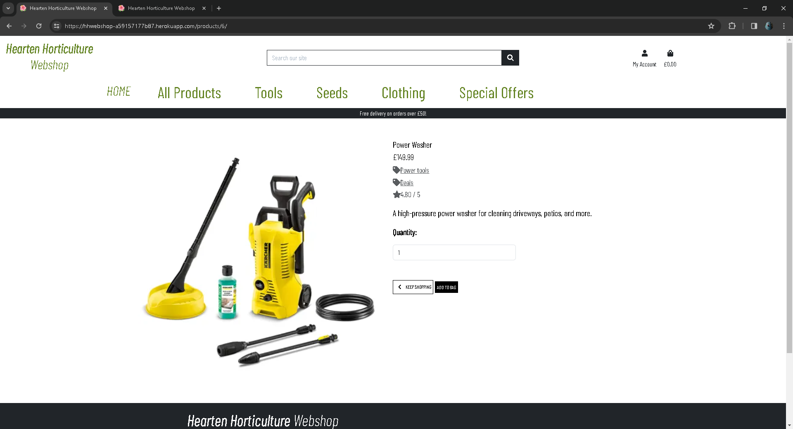
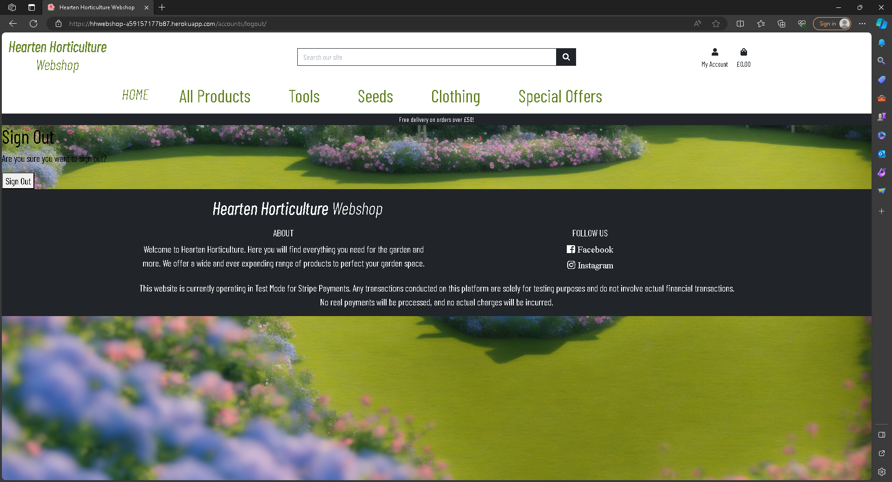
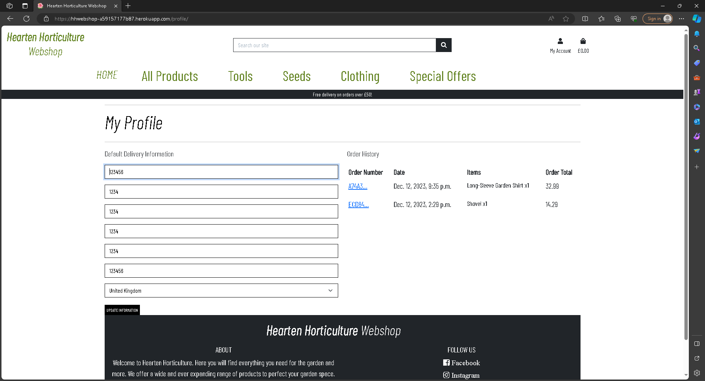
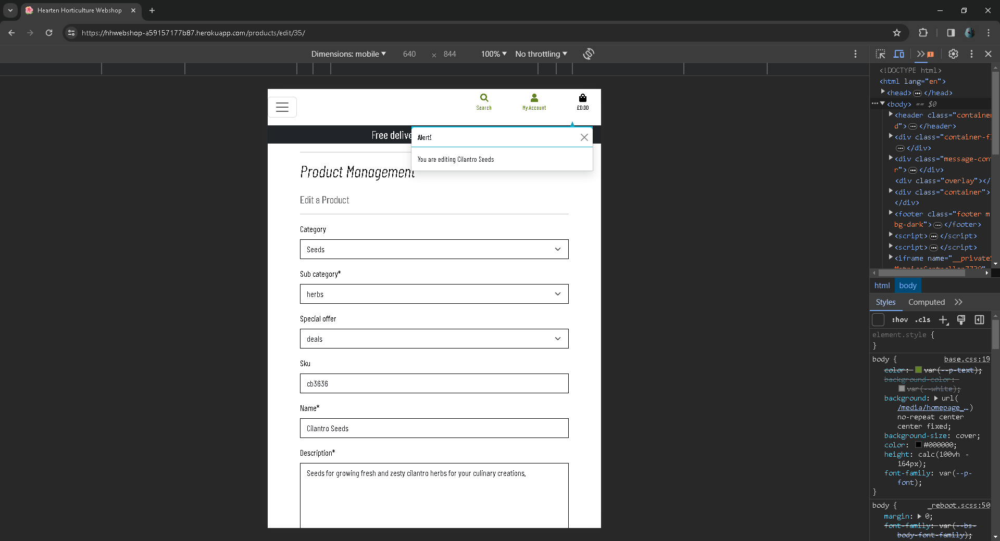
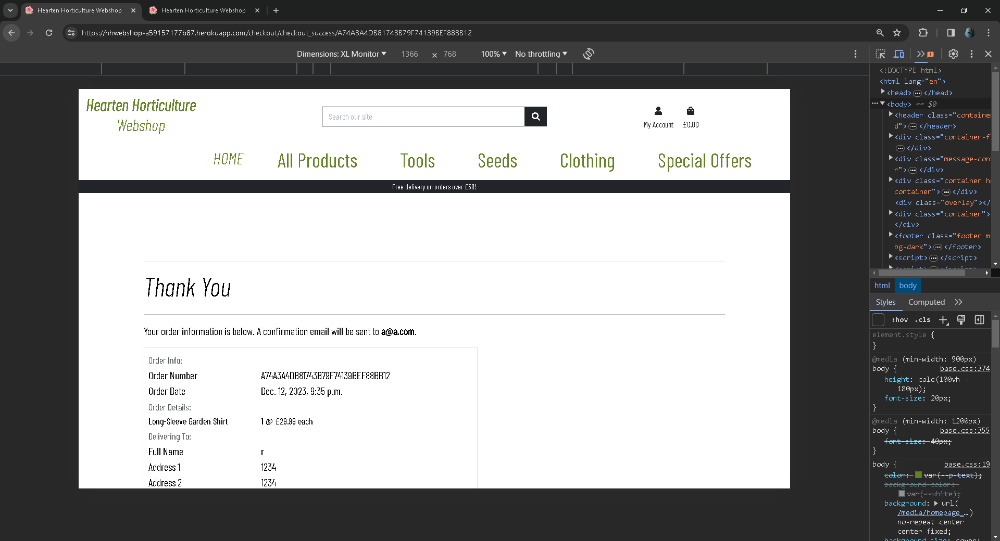
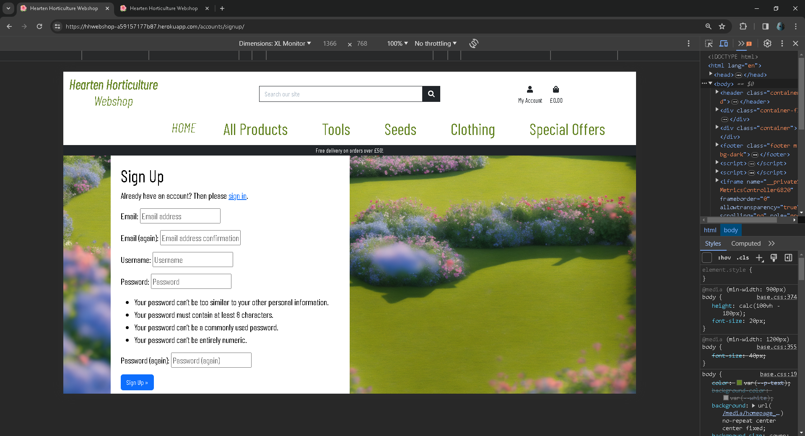
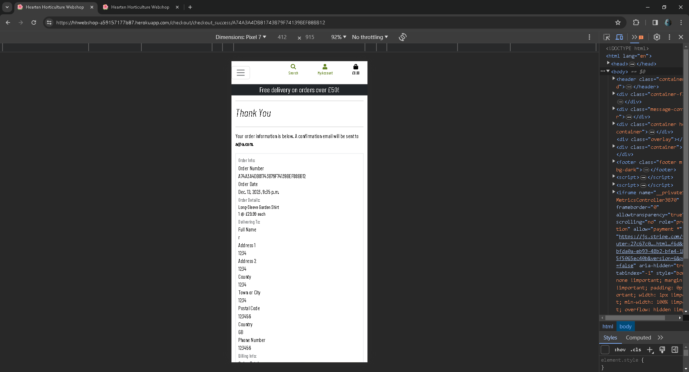
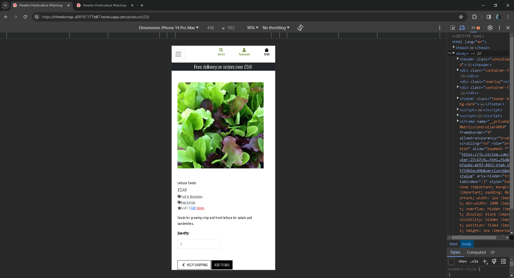
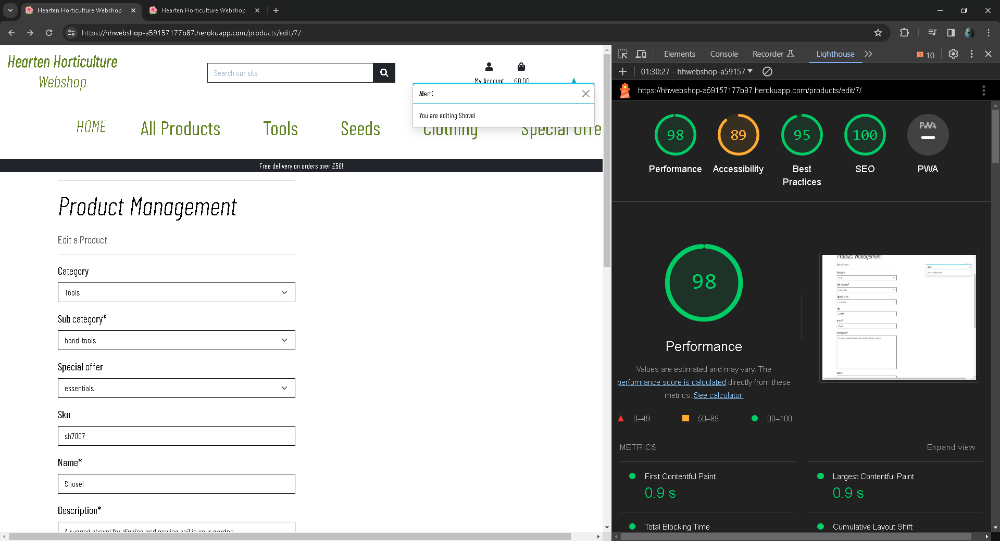

# Testing

Return back to the [README.md](README.md) file.

### HTML

I have used the recommended [HTML W3C Validator](https://validator.w3.org) to validate all of my HTML files.

| Page | W3C URL | Screenshot | Notes |
| --- | --- | --- | --- |
| Home | [W3C](https://validator.w3.org/nu/?doc=https%3A%2F%2Fhhwebshop-a59157177b87.herokuapp.com%2F) |  | Pass |
| Products | [W3C](https://validator.w3.org/nu/?doc=https%3A%2F%2Fhhwebshop-a59157177b87.herokuapp.com%2Fproducts%2Fproducts) |  | Pass |
| Product Details | [W3C](https://validator.w3.org/nu/?showsource=yes&doc=https%3A%2F%2Fhhwebshop-a59157177b87.herokuapp.com%2Fproducts%2F1%2F) |  | Pass |
| Checkout | [W3C](https://validator.w3.org/nu/#textarea) |  | Pass: 3 errors shown are created by stripe, check required validation by input as an error occurs otherwise |
| Bag | [W3C](https://validator.w3.org/nu/?showsource=yes&doc=https%3A%2F%2Fhhwebshop-a59157177b87.herokuapp.com%2Fbag%2F#l312c63) |  | Pass: No Errors |
| Checkout Success | [W3C](https://validator.w3.org/nu/?showsource=yes&doc=https%3A%2F%2Fhhwebshop-a59157177b87.herokuapp.com%2Fcheckout%2Fcheckout_success%2FECD84BE070E84329BF9BAE2D76CC96C5#l312c63) |  | Pass: No Errors |
| Add Product | [W3C](https://validator.w3.org/nu/?showsource=yes&doc=https%3A%2F%2Fhhwebshop-a59157177b87.herokuapp.com%2Fproducts%2Fadd%2F#l312c63) |  | Pass: Gives info on a trailing slash but it doesn't appear to be from my code |
| Edit Product | [W3C](https://validator.w3.org/nu/?showsource=yes&doc=https%3A%2F%2Fhhwebshop-a59157177b87.herokuapp.com%2Fproducts%2Fedit%2F7%2F#l312c63) |  | Pass: Gives info on a trailing slash but it doesn't appear to be from my code |
| Login | [W3C](https://validator.w3.org/nu/?showsource=yes&doc=https%3A%2F%2Fhhwebshop-a59157177b87.herokuapp.com%2Faccounts%2Flogin%2F#l293c448) |  | Pass: No Errors |
| Signup / Registration | [W3C](https://validator.w3.org/nu/?showsource=yes&doc=https%3A%2F%2Fhhwebshop-a59157177b87.herokuapp.com%2Faccounts%2Fsignup%2F#l293c452) |  | Errors created by allauth adding an additional 
 tag to the existing code |
| Sign Out | [W3C](https://validator.w3.org/nu/?showsource=yes&doc=https%3A%2F%2Fhhwebshop-a59157177b87.herokuapp.com%2Faccounts%2Flogout%2F#l293c448) |  | Pass: No Errors |
| Profile | [W3C](https://validator.w3.org/nu/?showsource=yes&doc=https%3A%2F%2Fhhwebshop-a59157177b87.herokuapp.com%2Fprofile%2F#l293c448) |  | Pass: No Errors |
| Error 404 | [W3C](https://validator.w3.org) |  | Pass: validatied by viewing source |
| error 500 | [W3C](https://validator.w3.org) | | Pass: changed "<form class="mt-3" action="" profile url to cause the error deliberately |

### CSS

I have used the recommended [CSS Jigsaw Validator](https://jigsaw.w3.org/css-validator) to validate all of my CSS files.

[CSS DEPLOYED SITE VALIDATION](https://jigsaw.w3.org/css-validator/validator?uri=https%3A%2F%2Fhhwebshop-a59157177b87.herokuapp.com%2F&profile=css3svg&usermedium=all&warning=1&vextwarning=&lang=en#errors)

Testing the  deployed site URL has numerous bootstrap warnings, but there are no errors in my base.css or checkout.css code.

| File | Jigsaw URL | Screenshot | Notes |
| --- | --- | --- | --- |
| base.css | [Jigsaw](https://jigsaw.w3.org/) |  | Pass: No Errors, manual input |
| checkout.css | [Jigsaw](https://jigsaw.w3.org/)  |  | Pass: No Errors, manual input |

### JavaScript

I have used the recommended [JShint Validator](https://jshint.com) to validate all of my JS files.

| File | Screenshot | Notes |
| --- | --- | --- |
| script.js |  | None |
| stripe_elements.js |  | Undefined Stripe variable |

### Python

I have used the recommended [PEP8 CI Python Linter](https://pep8ci.herokuapp.com) to validate all of my Python files.

| File | CI URL | Screenshot | Notes |
| --- | --- | --- | --- |
| manage.py | [PEP8 CI](https://pep8ci.herokuapp.com/https://raw.githubusercontent.com/rhysbobbett/hhwebshop/main/manage.py) |  | No errors |
| custom_storages.py | [PEP8 CI](https://pep8ci.herokuapp.com/https://raw.githubusercontent.com/rhysbobbett/hhwebshop/main/custom_storages.py) |  | Pass: No Errors | 
| bag contexts.py | [PEP8 CI](https://pep8ci.herokuapp.com/https://raw.githubusercontent.com/rhysbobbett/hhwebshop/main/bag/contexts.py) |  | Pass: No Errors |
| bag urls.py | [PEP8 CI](https://pep8ci.herokuapp.com/https://raw.githubusercontent.com/rhysbobbett/hhwebshop/main/bag/contexts.py) |  | Pass: No Errors |
| bag views.py | [PEP8 CI](https://pep8ci.herokuapp.com/https://raw.githubusercontent.com/rhysbobbett/hhwebshop/main/bag/contexts.py) |  | Pass: No Errors |
| Checkout admin.py | [PEP8 CI](https://pep8ci.herokuapp.com/https://raw.githubusercontent.com/rhysbobbett/hhwebshop/main/checkout/admin.py) |  | Pass: No Errors |
| Checkout forms.py | [PEP8 CI](https://pep8ci.herokuapp.com/https://raw.githubusercontent.com/rhysbobbett/hhwebshop/main/checkout/forms.py) |  | Pass: No Errors |
| Checkout models.py | [PEP8 CI](https://pep8ci.herokuapp.com/https://raw.githubusercontent.com/rhysbobbett/hhwebshop/main/checkout/models.py) |  | Pass: No Errors |
| Checkout signals.py | [PEP8 CI](https://pep8ci.herokuapp.com/https://raw.githubusercontent.com/rhysbobbett/hhwebshop/main/checkout/signals.py) |  | Pass: No Errors |
| Checkout urls.py | [PEP8 CI](https://pep8ci.herokuapp.com/https://raw.githubusercontent.com/rhysbobbett/hhwebshop/main/checkout/urls.py) |  | Pass: No Errors  |
| Checkout views.py | [PEP8 CI](https://pep8ci.herokuapp.com/https://raw.githubusercontent.com/rhysbobbett/hhwebshop/main/checkout/views.py) |  | Pass: No Errors |
| Checkout webhook_handler.py | [PEP8 CI](https://pep8ci.herokuapp.com/https://raw.githubusercontent.com/rhysbobbett/hhwebshop/main/checkout/webhook_handler.py) |  | Pass: No Errors |
| Checkout webhooks.py | [PEP8 CI](https://pep8ci.herokuapp.com/https://raw.githubusercontent.com/rhysbobbett/hhwebshop/main/checkout/webhooks.py) |  | Pass: No Errors |
| hhwebshop settings.py | [PEP8 CI](https://pep8ci.herokuapp.com/https://raw.githubusercontent.com/rhysbobbett/hhwebshop/main/hhwebshop/settings.py) |  | Pass: No Errors |
| hhwebshop urls.py | [PEP8 CI](https://pep8ci.herokuapp.com/https://raw.githubusercontent.com/rhysbobbett/hhwebshop/main/hhwebshop/settings.py) |  | Pass: No Errors |
| Home urls.py | [PEP8 CI](https://pep8ci.herokuapp.com/https://raw.githubusercontent.com/rhysbobbett/hhwebshop/main/home/urls.py) |  | Pass: No Errors |
| Home views.py | [PEP8 CI](https://pep8ci.herokuapp.com/https://raw.githubusercontent.com/rhysbobbett/hhwebshop/main/home/views.py) |  | Pass: No Errors |
| Products admin.py | [PEP8 CI](https://pep8ci.herokuapp.com/https://raw.githubusercontent.com/rhysbobbett/hhwebshop/main/products/admin.py) |  | Pass: No Errors |
| Products forms.py | [PEP8 CI](https://pep8ci.herokuapp.com/https://raw.githubusercontent.com/rhysbobbett/hhwebshop/main/products/forms.py) |  | Pass: No Errors |
| Products models.py | [PEP8 CI](https://pep8ci.herokuapp.com/https://raw.githubusercontent.com/rhysbobbett/hhwebshop/main/products/models.py) |  | Pass: No Errors |
| Products urls.py | [PEP8 CI](https://pep8ci.herokuapp.com/https://raw.githubusercontent.com/rhysbobbett/hhwebshop/main/products/urls.py) |  | Pass: No Errors |
| Products views.py | [PEP8 CI](https://pep8ci.herokuapp.com/https://raw.githubusercontent.com/rhysbobbett/hhwebshop/main/products/views.py) |  | Pass: No Errors |
| Products widgets.py | [PEP8 CI](https://pep8ci.herokuapp.com/https://raw.githubusercontent.com/rhysbobbett/hhwebshop/main/products/widgets.py) |  | Pass: No Errors |
| Profiles forms.py | [PEP8 CI](https://pep8ci.herokuapp.com/https://raw.githubusercontent.com/rhysbobbett/hhwebshop/main/profiles/forms.py) |  | Pass: No Errors |
| Profiles models.py | [PEP8 CI](https://pep8ci.herokuapp.com/https://raw.githubusercontent.com/rhysbobbett/hhwebshop/main/profiles/models.py) |  | Pass: No Errors |
| Profiles urls.py | [PEP8 CI](https://pep8ci.herokuapp.com/https://raw.githubusercontent.com/rhysbobbett/hhwebshop/main/profiles/urls.py) |  | Pass: No Errors |
| Profiles views.py | [PEP8 CI](https://pep8ci.herokuapp.com/https://raw.githubusercontent.com/rhysbobbett/hhwebshop/main/profiles/views.py) |  | 1 TokenError, maybe presense of a non-acsii character |

## Browser Compatibility

Recommended browsers to consider:
- [Chrome](https://www.google.com/chrome)
- [Firefox (Developer Edition)](https://www.mozilla.org/firefox/developer)
- [Edge](https://www.microsoft.com/edge)

| Browser | Home | Products | Product Details | Checkout | Bag | Checkout Success | Add Product | Edit Product | Login | Registration | Sign Out | Profile | Error 404 | Notes |
| --- | --- | --- | --- | --- | --- | --- | --- | --- | --- | --- | --- | --- | --- | --- |
| Chrome |  |  |  |  |  |  |  |  |  |  |  |  |  | Signout and Error404 text are too obscured |
| Firefox Developer edition |  |  |  |  |  |  |  |  |  |  |  |  |  | Signout and Error404 text are too obscured |
| Edge |  |  |  |  |  |  |  |  |  |  |  |  |  | as with other browsers, 404 and signout could do with some coloured backing to increase contrast of the fonts |

## Responsiveness
I've tested my deployed project on multiple devices to check for responsiveness issues.
Devtools was used to simulate larger screen sizes with certain devices

| Device | Home | Products | Product Details | Checkout | Bag | Checkout Success | Add Product | Edit Product | Login | Registration | Sign Out | Profile | Error 404 | Notes |
| --- | --- | --- | --- | --- | --- | --- | --- | --- | --- | --- | --- | --- | --- | --- |
| Mobile (DevTools) |  |  |  |  |  |  |  |  |  |  |  |  |  | The sign out text and error404 text are too dark against the green of the background, the page should be made so it adapts when the error folder is referenced or the account page is referenced |
| Tablet (DevTools - iPad Air) |  |  |  |  |  |  |  |  |  |  |  |  |  | The iPad devtools view provides a wider display of products than mobile view, but still is compact due to the collapsible navbar.  |
| Desktop |  |  |  |  |  |  |  |  |  |  |  |  |  | This has the been the most often used resolution for the development of the site and works across the pages |
| XL Monitor (Devtools) |  |  |  |  |  |  |  |  |  |  |  |  |  | Pages appear to all view correctly as intended |
| 4K Monitor (Devtools) |  |  |  |  |  |  |  |  |  |  |  |  |  | My profile page doesn't display in devtools on my display unless I view it zoomed out to 50%, other pages could be better optimised for 4k as a future update. |
| Google Pixel 7 |  |  |  |  |  |  |  |  |  |  |  |  |  | All pages displayed correctly and visible apart from error404. |
| iPhone 14 |  |  |  |  |  |  |  |  |  |  |  |  |  | As with the first mobile view, the signout text is too dark against the green background image and will need to be changed |

## Lighthouse Audit

The site's image size, organisation and retrieval of information makes it slow to load, and performance suffers on any page featuring a static image file.

I've tested my deployed project using the Lighthouse Audit tool to check for any major issues.

| Page | Mobile | Desktop | Notes |
| --- | --- | --- | --- |
| Home |  |  | Mobile performance suffers due to images |
| Products |  |  | Slow response time due to large images |
| Product Details |  |  | Slow response time due to large images |
| Bag |  |  | Slow response time due to large images |
| Checkout Success |  |  | Slow response time due to large images |
| Add Product |  |  | Mobile performance suffers due to images |
| Edit Product |  |  | Mobile performance suffers due to images |
| Login |  |  | Mobile performance suffers due to images  |
| Signup / Registration |  |  | Mobile performance suffers due to images |
| Sign Out |  |  | Mobile performance suffers due to images |
| Profile |  |  | Mobile performance suffers due to images |

## Defensive Programming

Forms:
- Users cannot submit an empty form
- Users must enter valid email addresses
- User passwords must not contain reference to name or username, must contain numbers.
- User must state a country in checkout

Django:
- Users cannot brute-force a URL to navigate to a restricted page
- Users cannot perform CRUD functionality while logged-out
- User-A should not be able to manipulate data belonging to User-B, or vice versa
- Non-Authenticated users should not be able to access pages that require authentication
- Standard users should not be able to access pages intended for superusers

Defensive programming was manually tested with the below user acceptance testing:

| Page | Expectation | Test | Result | Fix | Screenshot |
| --- | --- | --- | --- | --- | --- |
| Home | | | | | |
| Shop now button | Clickinig the button takes a user to all products | Clicked the button to test, takes me to products | The feature behaved as expected | Test concluded and passed |  |
| Search Box | Anything can be put in the search box, but putting nothing in will bring up all products | Tested the feature by clicking with no text | The feature responded as expected | Test concluded and passed |  |
| Products | | | | | |
| The products can be sorted by various categories (a=z, price, rating)  | The filter was selected from the dropdown and resorts the products accordingly | Tested the feature by changing sort categories | The feature behaved as expected, and it sorts as described | Test concluded and passed |  |
| Verify product filtering with specific criteria | When a tag is clicked, all products are filtered to that specific category | Tested the feature by clicking 'herbs' | Worked as expected, all herbs populate the products page | Test concluded, passed |  |
| Product Details | | | | | |
| Product quantity cannont be less than 1 | a notification should appear if less than 1 is entered in quantity | Tested the feature by entering 0 | The feature behaved as expected, and it did provided the notification | Test concluded and passed |  |
| Special offers within product details | Feature is expected to filter all products in that given category by their special offer tag stated in the product description | Tested the feature clicking the offer tag | The product filter than categories according to subcategory and which special offer has been clicked | This could be developed further for more control over product filtering |  |
| Add product | | | | | |
| Essential forms require data | Feature is expected to provide notification when the user does not enter into a form such as name, price and description | Tested the feature by doing not entering data into the fields | The feature behaved as expected, and it provided notification that it is a required field. It does this for all essential fields | Test concluded and passed |  |
| image upload | Feature is expected to upload an image when the user clicks upload | Tested the feature by uploading an image | The image appears in the product details | I tested by uploading a favicon.ico image for convenience but other images work. |  |
| Edit product | | | | | |
| Edit a product details | Feature is expected to do update details on button click if a user changes any existing details | Tested the feature by editting the product in the add-product features section above | The feature behaved as expected, and it did update the relevant fields | Test concluded and passed |  |
| Edit a product image | Feature is expected to do update details on button click if a user changes the existing image in the upload preview section | Tested the feature by editting the product in the add-product features section above, updating the image to something else | The feature behaved as expected, and it did update the relevant image | Test concluded and passed, screenshot is post-edit on the edit-product page |  |
| Checkout | | | | | |
| Name field is required | Feature is expected to give a notification when blank | Tested the feature by leaving name field blank | The feature behaved as expected, and it provided the notification and would not proceed without it | Test concluded and passed, this applies to the email field, phone number, address and credit card fields also |  |
| Order email to sent from the business email address, user receives order confirmation email | Feature is expected to send email upon completion when the user makes a purchase | Tested the feature by placing an order | The feature behaved as expected, and it sent the email order notification | Test concluded and passed |  |
| Profile | Feature is expected to do X when the user does Y | Tested the feature by doing Y | The feature did not respond to A, B, or C. | I did Z to the code because something was missing |  |
| Signup | | | | | |
| Enter correct email | Feature is expected to display to the user that an email address is require to signup | Tested the feature by mistyping email in email address form | The feature behaved as expected | Test concluded and passed |  |
| Username must be a minimum length | Feature is expected to display notification when the user does enter a long enough username. | Tested the feature by entering too short a username | The feature works as intended | I did Z to the code because something was missing |  |
| Sign in | | | | | |
| Sign in page displaying correctly | Feature is expected to appear when the user clicks signin on the navbar | Tested the feature by clicking signin | The feature behaved as expected | Test concluded and passed |  |
| No user found | Feature is expected to display a error when the user enters a name not found in the system | Tested the feature by entering a wrong username | The feature works as intended | Tested passed |  |
| Sign out| | | | | |
| Signing out with a button | Feature is expected to do signout when the user clicks to signout | Tested the feature by attempting a signout | The feature behaved as expected, and it did have any issues | Test concluded and passed |  ||
| Error 404| | | | | |
| Page not found | Feature is expected to display Page not found test when the user types an incorrect url | Tested the feature by deliberately calling the 404 page. | The feature behaved as expected, and it did Y | Test concluded and passed |  |

## User Story Testing

| User Story | Screenshot 1 | Screenshot 2 | Screenshot 3 |
| --- | --- | --- | --- |
| As a new site user, I would like to create an account easily, so that I can save my preferences, view my order history, and manage my shipping information. |  |  |   |
As a new site user, I would like to search for plants or tools by their names or categories to explore available options. |  |  | 
| As a new site user, I would like to add items to my shopping cart and proceed to checkout to purchase the selected products. I should be able to edit the quantity of items if I make a mistake |  |  |  |
| As a returning site user, I would like to access my order history to review past purchases. |  | 
| As a returning site user, I would like to receive a confirmation email after placing my order for reference and tracking purposes. |  |
| As a site administrator, I should be able to manage user accounts and permissions, so that I can control access levels and ensure site security. |  |
| As a site administrator, I should be able to update and add new product listings, so that I can keep the site content current and attractive to customers. |  |

## Bugs
The development has shown any problem bugs that have inhibited the main functionality of the site.
I saved one bug early on in Issues, but have yet to find a solution to this. It is a minor issue that doesn't affect the running of the site. 

- During development I encountered a few issues with deployment that were due to simple typos within the heroku env config variables.
    
    - These were fixed by providing the correct variables in the heroku config fields, and double checking their spelling and format.

- When using devtools to simulate an iPad Pro, the page starts to have `overflow-x` scrolling.

    

    - Attempted fix: a rewrite of my media queries maybe required in order to fix this issue as it appears to have conflicts with other essential elements such as the Stripe payments overlay.

- Django Allauth is adding an unnecessary < p > < /p > tag which causes the HTML validation to error.
    
    - Attempted search for a solution: screenshots are noted in the issues section of the repository, this is believed to be allauth adding a < p > tag and for now is not a fix I understand how to solve.

There are no remaining bugs that I am aware of.