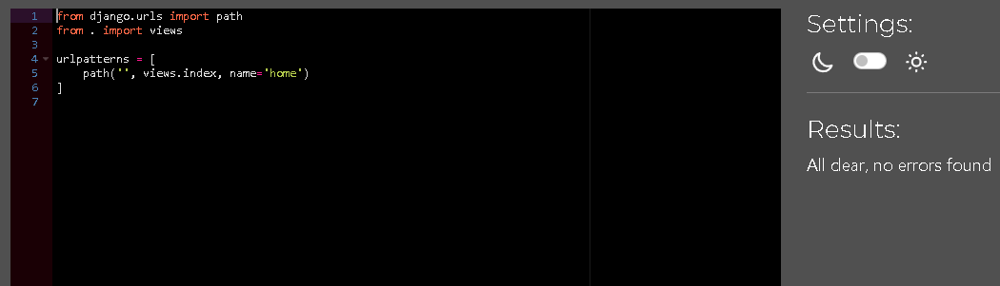

# Testing

Return back to the [README.md](README.md) file.

### HTML

I have used the recommended [HTML W3C Validator](https://validator.w3.org) to validate all of my HTML files.

| Page | W3C URL | Screenshot | Notes |
| --- | --- | --- | --- |
| Home | [W3C](https://validator.w3.org/nu/?doc=https%3A%2F%2Fhhwebshop-a59157177b87.herokuapp.com%2F) |  | Pass |
| Products | [W3C](https://validator.w3.org/nu/?doc=https%3A%2F%2Fhhwebshop-a59157177b87.herokuapp.com%2Fproducts%2Fproducts) |  | Pass |
| Product Details | [W3C](https://validator.w3.org/nu/?showsource=yes&doc=https%3A%2F%2Fhhwebshop-a59157177b87.herokuapp.com%2Fproducts%2F1%2F) |  | Pass |
| Checkout | [W3C](https://validator.w3.org/nu/#textarea) |  | Pass: 3 errors shown are created by stripe, check required validation by input as an error occurs otherwise |
| Bag | [W3C](https://validator.w3.org/nu/?showsource=yes&doc=https%3A%2F%2Fhhwebshop-a59157177b87.herokuapp.com%2Fbag%2F#l312c63) |  | Pass: No Errors |
| Checkout Success | [W3C](https://validator.w3.org/nu/?showsource=yes&doc=https%3A%2F%2Fhhwebshop-a59157177b87.herokuapp.com%2Fcheckout%2Fcheckout_success%2FECD84BE070E84329BF9BAE2D76CC96C5#l312c63) |  | Pass: No Errors |
| Add Product | [W3C](https://validator.w3.org/nu/?showsource=yes&doc=https%3A%2F%2Fhhwebshop-a59157177b87.herokuapp.com%2Fproducts%2Fadd%2F#l312c63) |  | Pass: Gives info on a trailing slash but it doesn't appear to be from my code |
| Edit Product | [W3C](https://validator.w3.org/nu/?showsource=yes&doc=https%3A%2F%2Fhhwebshop-a59157177b87.herokuapp.com%2Fproducts%2Fedit%2F7%2F#l312c63) |  | Pass: Gives info on a trailing slash but it doesn't appear to be from my code |
| Login | [W3C](https://validator.w3.org/nu/?showsource=yes&doc=https%3A%2F%2Fhhwebshop-a59157177b87.herokuapp.com%2Faccounts%2Flogin%2F#l293c448) |  | Pass: No Errors |
| Signup / Registration | [W3C](https://validator.w3.org/nu/?showsource=yes&doc=https%3A%2F%2Fhhwebshop-a59157177b87.herokuapp.com%2Faccounts%2Fsignup%2F#l293c452) |  | Errors created by allauth adding an additional 
 tag to the existing code |
| Sign Out | [W3C](https://validator.w3.org/nu/?showsource=yes&doc=https%3A%2F%2Fhhwebshop-a59157177b87.herokuapp.com%2Faccounts%2Flogout%2F#l293c448) |  | Pass: No Errors |
| Profile | [W3C](https://validator.w3.org/nu/?showsource=yes&doc=https%3A%2F%2Fhhwebshop-a59157177b87.herokuapp.com%2Fprofile%2F#l293c448) |  | Pass: No Errors |
| error 404 | [W3C](https://validator.w3.org) |  | Pass: validatied by viewing source |
| error 500 | [W3C](https://validator.w3.org) | | Pass: changed "<form class="mt-3" action="" profile url to cause the error deliberately |

### CSS

I have used the recommended [CSS Jigsaw Validator](https://jigsaw.w3.org/css-validator) to validate all of my CSS files.

Testing the  deployed site URL has numerous bootstrap warnings, but there are no errors in my base.css or checkout.css code.

| File | Jigsaw URL | Screenshot | Notes |
| --- | --- | --- | --- |
| base.css | [Jigsaw](https://jigsaw.w3.org/) |  | Pass: No Errors, manual input |
| checkout.css | [Jigsaw](https://jigsaw.w3.org/)  |  | Pass: No Errors, manual input |

### JavaScript

I have used the recommended [JShint Validator](https://jshint.com) to validate all of my JS files.

| File | Screenshot | Notes |
| --- | --- | --- |
| script.js |  | None |
| stripe_elements.js |  | Undefined Stripe variable |

### Python

I have used the recommended [PEP8 CI Python Linter](https://pep8ci.herokuapp.com) to validate all of my Python files.

| File | CI URL | Screenshot | Notes |
| --- | --- | --- | --- |
| manage.py | [PEP8 CI](https://pep8ci.herokuapp.com/https://raw.githubusercontent.com/rhysbobbett/hhwebshop/main/manage.py) |  | No errors |
| custom_storages.py | [PEP8 CI](https://pep8ci.herokuapp.com/https://raw.githubusercontent.com/rhysbobbett/hhwebshop/main/custom_storages.py) |  | Pass: No Errors | 
| bag contexts.py | [PEP8 CI](https://pep8ci.herokuapp.com/https://raw.githubusercontent.com/rhysbobbett/hhwebshop/main/bag/contexts.py) |  | Pass: No Errors |
| bag urls.py | [PEP8 CI](https://pep8ci.herokuapp.com/https://raw.githubusercontent.com/rhysbobbett/hhwebshop/main/bag/contexts.py) |  | Pass: No Errors |
| bag views.py | [PEP8 CI](https://pep8ci.herokuapp.com/https://raw.githubusercontent.com/rhysbobbett/hhwebshop/main/bag/contexts.py) |  | Pass: No Errors |
| Checkout admin.py | [PEP8 CI](https://pep8ci.herokuapp.com/https://raw.githubusercontent.com/rhysbobbett/hhwebshop/main/checkout/admin.py) |  | Pass: No Errors |
| Checkout forms.py | [PEP8 CI](https://pep8ci.herokuapp.com/https://raw.githubusercontent.com/rhysbobbett/hhwebshop/main/checkout/forms.py) |  | Pass: No Errors |
| Checkout models.py | [PEP8 CI](https://pep8ci.herokuapp.com/https://raw.githubusercontent.com/rhysbobbett/hhwebshop/main/checkout/models.py) |  | Pass: No Errors |
| Checkout signals.py | [PEP8 CI](https://pep8ci.herokuapp.com/https://raw.githubusercontent.com/rhysbobbett/hhwebshop/main/checkout/signals.py) |  | Pass: No Errors |
| Checkout urls.py | [PEP8 CI](https://pep8ci.herokuapp.com/https://raw.githubusercontent.com/rhysbobbett/hhwebshop/main/checkout/urls.py) |  | Pass: No Errors  |
| Checkout views.py | [PEP8 CI](https://pep8ci.herokuapp.com/https://raw.githubusercontent.com/rhysbobbett/hhwebshop/main/checkout/views.py) |  | Pass: No Errors |
| Checkout webhook_handler.py | [PEP8 CI](https://pep8ci.herokuapp.com/https://raw.githubusercontent.com/rhysbobbett/hhwebshop/main/checkout/webhook_handler.py) |  | Pass: No Errors |
| Checkout webhooks.py | [PEP8 CI](https://pep8ci.herokuapp.com/https://raw.githubusercontent.com/rhysbobbett/hhwebshop/main/checkout/webhooks.py) |  | Pass: No Errors |
| hhwebshop settings.py | [PEP8 CI](https://pep8ci.herokuapp.com/https://raw.githubusercontent.com/rhysbobbett/hhwebshop/main/hhwebshop/settings.py) |  | Pass: No Errors |
| hhwebshop urls.py | [PEP8 CI](https://pep8ci.herokuapp.com/https://raw.githubusercontent.com/rhysbobbett/hhwebshop/main/hhwebshop/settings.py) |  | Pass: No Errors |
| Home urls.py | [PEP8 CI](https://pep8ci.herokuapp.com/https://raw.githubusercontent.com/rhysbobbett/hhwebshop/main/home/urls.py) |  | Pass: No Errors |
| Home views.py | [PEP8 CI](https://pep8ci.herokuapp.com/https://raw.githubusercontent.com/rhysbobbett/hhwebshop/main/home/views.py) |  | Pass: No Errors |
| Products admin.py | [PEP8 CI](https://pep8ci.herokuapp.com/https://raw.githubusercontent.com/rhysbobbett/hhwebshop/main/products/admin.py) |  | Pass: No Errors |
| Products forms.py | [PEP8 CI](https://pep8ci.herokuapp.com/https://raw.githubusercontent.com/rhysbobbett/hhwebshop/main/products/forms.py) |  | Pass: No Errors |
| Products models.py | [PEP8 CI](https://pep8ci.herokuapp.com/https://raw.githubusercontent.com/rhysbobbett/hhwebshop/main/products/models.py) |  | Pass: No Errors |
| Products urls.py | [PEP8 CI](https://pep8ci.herokuapp.com/https://raw.githubusercontent.com/rhysbobbett/hhwebshop/main/products/urls.py) |  | Pass: No Errors |
| Products views.py | [PEP8 CI](https://pep8ci.herokuapp.com/https://raw.githubusercontent.com/rhysbobbett/hhwebshop/main/products/views.py) |  | Pass: No Errors |
| Products widgets.py | [PEP8 CI](https://pep8ci.herokuapp.com/https://raw.githubusercontent.com/rhysbobbett/hhwebshop/main/products/widgets.py) |  | Pass: No Errors |
| Profiles forms.py | [PEP8 CI](https://pep8ci.herokuapp.com/https://raw.githubusercontent.com/rhysbobbett/hhwebshop/main/profiles/forms.py) |  | Pass: No Errors |
| Profiles models.py | [PEP8 CI](https://pep8ci.herokuapp.com/https://raw.githubusercontent.com/rhysbobbett/hhwebshop/main/profiles/models.py) |  | Pass: No Errors |
| Profiles urls.py | [PEP8 CI](https://pep8ci.herokuapp.com/https://raw.githubusercontent.com/rhysbobbett/hhwebshop/main/profiles/urls.py) |  | Pass: No Errors |
| Profiles views.py | [PEP8 CI](https://pep8ci.herokuapp.com/https://raw.githubusercontent.com/rhysbobbett/hhwebshop/main/profiles/views.py) |  | 1 TokenError, maybe presense of a non-acsii character |

